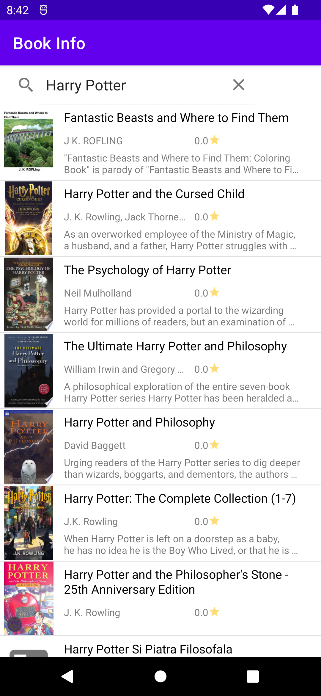
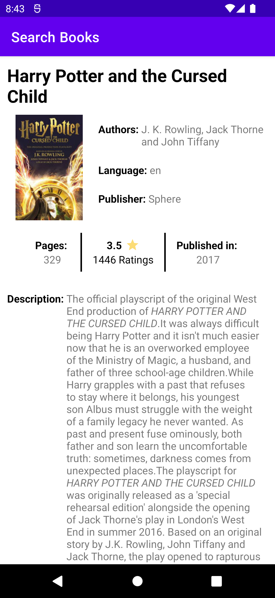

# Book Query

It is a two screen java android application which is used to search books. It is the practice project given in udacity course: Android Basics: Networking.

The app uses google books API to get books and their details and uses Android Loaders (I know it is deprecated now) to cache the result across configuration changes. Sending request to REST API and parsing of JSON to objects is done manually.

## Screenshots

|  |  |
|------------------------------------------------------------------|-------------------------------------------------------------------|

The first activity contains a search bar and a ListView. The second one is a details activity that displays more info about the selected book.
